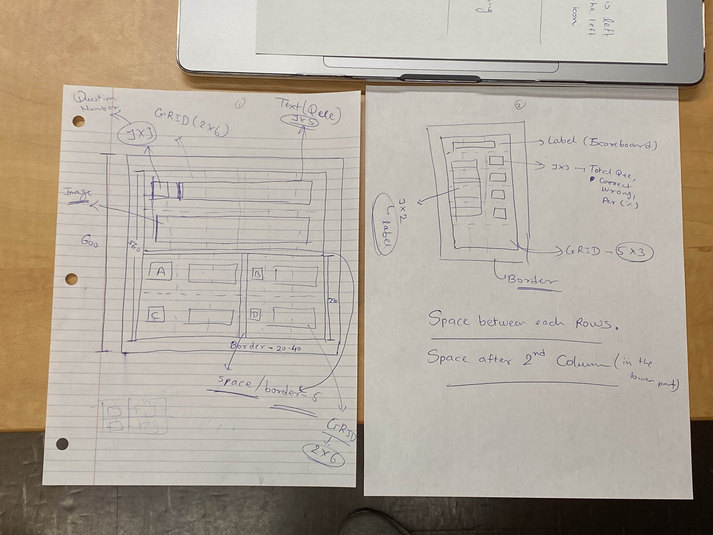

# COMP8120 - Assignment 01
## Group Information - (Name [UWinID, StudentNumber])
1. Jainam Shah [shah2n1, 110116592]
2. Jiajie Yang [yang4q, 110115897]
3. Pawankumar Akbari [akbari8, 110091737]

## Introduction
This is a starter project for COMP-8120 F2022 at the University of Windsor. The project is a quiz application on which users can answer questions with images and see their results.
## Setup
    * Download and install brew from [Homebrew](https://brew.sh/)
    * Install GTK+3 from [Homebrew Formulae](https://formulae.brew.sh/formula/gtk+3)
    * alias gtkcompile="gcc `pkg-config --cflags gtk+-3.0` `pkg-config --libs gtk+-3.0` -o"

## Log
### D1: Sept 15: Brainstorming
We have an idea of implementing chat windows that allow one user to input some texts or choose some emoji from a provided pool of clickable emoji symbols in a certain user's window. Then the user can push them onto the user's screen and display the content to all the windows.

### D2: Sept 16: Brainstorming, Design, and Coding
#### Photos for referencing

#### Brainstorming
- Create another idea for our project: To implement a quiz application. The quiz questions are basically multiple choice questions with additional images aside providing more information.
- Vote and decide to choose an idea to implement: Our project is to implement a quiz application.

#### Design

- Basic version of our quiz application: This basic version will contain the core functions such as displaying questions, performing clickable buttons and summarizing the quiz result. We decided to have two windows(quiz window and score window) popped out when users start our application. One window is performing the interactions with users such as displaying and clicking. The other window is only displaying scores. There are 3 features of the basic version quiz application:
    1. The background colours of the quiz window indicate the difficulty of the corresponding question. The red colour, blue colour, and green colour represent the difficulties of hard, medium, and easy respectively.
    2. There will be four provided option buttons for each question. After choosing one option and clicking, it will automatically jump into the next new question with no permission to change answers of past questions.
    3. The score window will update the result every time when the user selects an option in the quiz window.

- Upgrade version(implement only when basic version completed before midnight of Sept 18):
    1. Add a stage of registration: pop up two windows sequentially to ask users to input their name and the level of difficulties they are willing to have in this quiz time.
    2. Add a timer at the bottom of the quiz window. The timer will start when the first question is displayed and end when users click the "submit" button.
    3. Add two buttons of "previous" and "next" to allow users to explore questions and change the answers of past questions.
    4. Move the icon of our application to the upper-right corner of the two windows so that it will not be hidden beneath the "close", "minimize" and "full screen" buttons of the macOS.
    5. Display the registration information on the scoreboard window.
    6. Display the current status of each question on the score window such as "unanswered", "answered".

- Coding task decomposition for basic version
    1. Add a new window name.
    2. Add an icon to the upper-left corner(default) of the window, and orient the window to the desired position(centre left-adjust and centre right-adjust).
    3. Create 2 windows at a time.
    4. Add labels, buttons, background colours, and images.
    5. Refresh the two windows each time users click an option button.
    6. The background colour changes based on the difficulties of questions.

#### Coding
1. Complete the coding task 1 of adding a new window name in the file "1-addWindowName.c".
2. Complete the coding task 2 of adding an icon and orienting one window in the file "2-add-icon.c".
3. Complete the coding task 3 of creating 2 windows and orienting two windows in the file "3-add-two-window.c".

### D3: Sept 17: Coding
#### Coding
1. Complete the coding task 4 of adding widgets of the two windows in the files "4-create-label-button-add-image.c" and "4-create-label-score-screen.c".

### D4: Sept 18: Coding
#### Coding
1. Attempt to complete the coding task 5 of adding callback functions in the file "4-create-label-score-screen.c". One of the difficulties is passing labels as parameters to the user-defined void helper function. It would cause an error of "incompatible pointer types to 'GtkLabel *' from 'GtkWidget *'".
Note: The problem solved on D4 by using global variables.

### D5: Sept 19: Problem Solving, Coding
#### Problem Solving
##### Problem-1 and Solution-1
Problem: Using CALLBACK function and passing labels that will be updated each time after users click buttons create warning of incompatible pointer types and errors.
Solution: Use global variables to store the information about questions, user's quiz result, and background colours. This would be a temporary solution. Once figuring out the syntax of arguments passing in g_signal_connect.

##### Problem-2 and Solution-2
Problem: Need to refresh windows every time after users click an option button.
Solution: Write a CALLBACK function for each button and call button_press(GtkWidget *, gpointer). Inside the helper function 'button_press', execute uppdateScreen(), which updates the global variables that are previously defined to store information about windows, questions and results, at the end of 'button_press'.

#### Coding
1. Merge previous code files into one final file "lab-1-quiz-time.c".
2. Complete the coding task 5 of refreshing windows in the file "lab-1-quiz-time.c".
3. Complete the coding task 6 of changing the background colour of the quiz screen based on the difficulties of the questions and the background colour of the scoreboard screen based on the correctness of the user's current answer in the file "lab-1-quiz-time.c".

### D6: Sept 20: Extension Coding
#### Extension
1. Complete the ending exit part for answering all the questions.
2. Plan to add a start screen with a start button explicitly. After clicking the start button, it will lead users to the two main screens, which are the quiz screen and the scoreboard screen.
