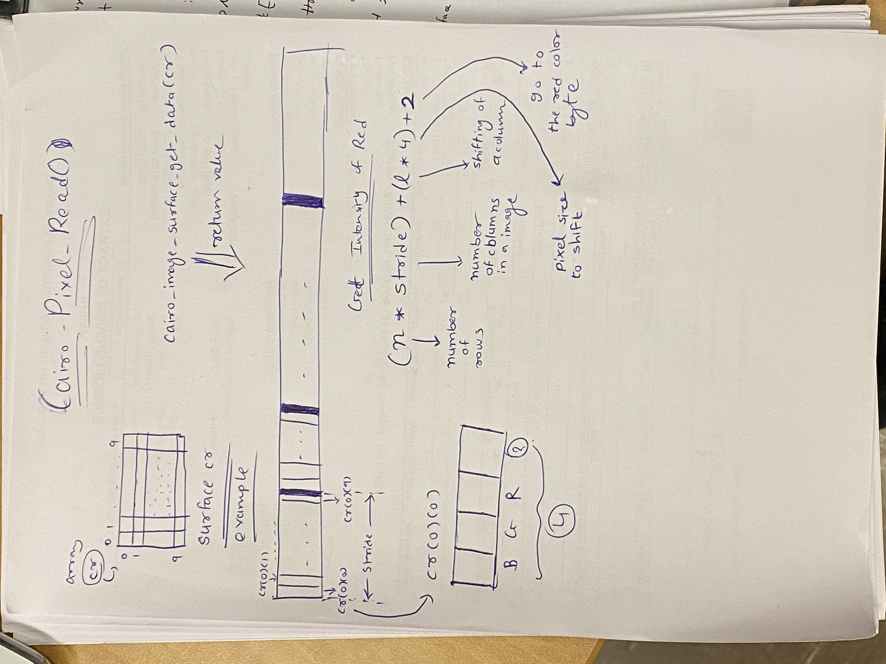

# Image Polishing Application
## Group Information
1. Jainam Shah
2. Jiajie Yang

## Introduction
The project is an image polishing application on which users can select colours from the images and use them to edit or draw shapes.
## Setup
    * Download and install brew from [Homebrew](https://brew.sh/)
    * Install GTK+3 from [Homebrew Formulae](https://formulae.brew.sh/formula/gtk+3)
    * Intall Cairo from [Homebrew Formulae] (https://formulae.brew.sh/formula/cairo)
    * alias gtkcompile="gcc `pkg-config --cflags gtk+-3.0` `pkg-config --libs gtk+-3.0` -o"

## Log
### D1 - D3: Sept 20 - 22: Getting Familiar with Cairo
We are using the Cairo documentation webpage(https://cairographics.org/tutorial/) to understand the basic drawing model. By compiling and running the sample files to, we learned how the drawing model are implemented in C code and how the output PNG file are created.

### D4: Sept 23: Demo Coding, Design
#### Demo Coding
- Create files, "8-1-polish.c" and "8-2-polish.c", by applying Cairo on GTK+3
- Create file of "9-2-coord-pixel-getter.c" to explore the feature of GdkEventButton structure and cairo_image_surface_get_data()
- Photos for reference

#### Design

### D5-D7: Sept 24-26: Coding
#### Coding
1. Complete the coding tasks in the files "lab_2...c".

### D8-D10: Sept 27-29: Bug Fixing
#### Challenge
1. Unable to save edited images.
#### Solution
1. Use a locally define cairo_t *cr associated with the image_info.surface to draw.
2. Use gtk_widget_queue_draw(screen) to refresh screens.

